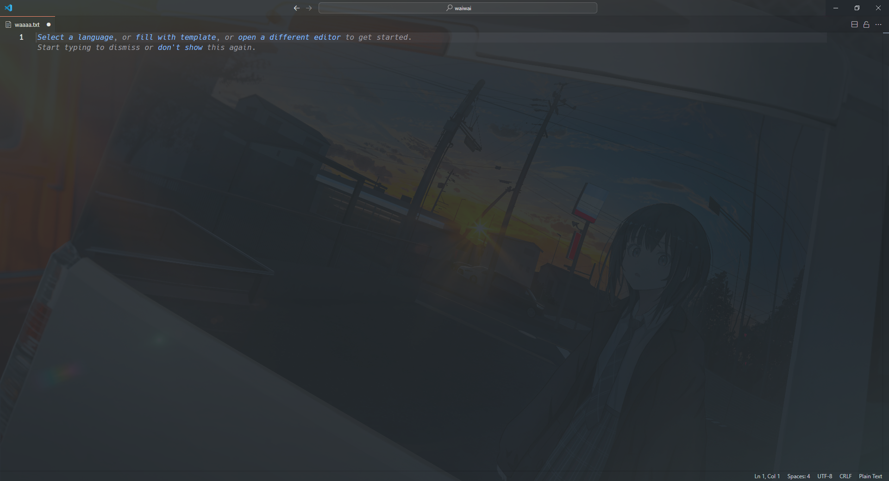

皆様、いかがお過ごしでしょうか。私の住む岩手県も朝は寒く、昼は暑いっていう地獄みたいな、、  
最悪ですねぇ…。  
## ブログ書いてますか?
このサイトはURLにもある通り、ブログとなっております。更新頻度はそこまで高くないですけどね。  
一度はブログを書こうとか思ったことないですか？そんでレンタルサーバーが必要かぁとあきらめた人もいるでしょう。(私も)  
このサイトはロリポップレンタルサーバーでホスティングされていますが、私が使っているhugoというシステムはレンタルサーバーではなくGithubPagesやCloudflarePagesでホスティングできます。  
今回は私がブログを運営するうえで使っているツールなどを紹介します。  
## 基礎
### hugo
hugoというシステム?静的サイトジェネレーターですかね。Next.jsとかastroでも同じことができるそうですが初心者には一番お勧めできます。  
これはマークダウンファイルからhtmlを生成して生成されたファイルを公開します。WordPressはphpっていう言語を使って動的にコンテンツを配信しますがhugoは静的です。  
特徴として上にも上げた通り、レンタルサーバーが不要なことです。最悪githubのアカウントがあれば公開できます。  
更新も活発で、結構な頻度で更新がやってきます。日本語での情報もそこそこ存在しますね。  
若干のHTML,CSSの知識が必要になりますが、ChatGPTに聞けば解決しそうですよ。  
### Github
これはどういうときに使うか。まずファイルの管理です。  
私はMacBookとWindowsを使っています。`git push`と`git pull`で簡単に管理できるので楽ですよ。  
あとはロリポップへの公開もActionsを使用しています。  
FTPアップロードが使えるので、コミットを切ったタイミングでビルドを実行して成果物をftpでアップロードする。  
それを担っていただいております。  
## 執筆
### VSCode
定番のIDEですね。私はVimとか使えないのでおとなしくGUIで親切なやつを使っています。  
Gitの操作もボタンﾎﾟﾁﾎﾟﾁでできるのですごく便利ですね。  
また拡張機能でめんどくさい画像の貼り付けも簡単にできるようになるので使わない理由はないかな。  
#### Background
使っているってわけではないですが、VSCodeの背景に画像を設定できる拡張機能です。  

こんな感じでkawaii開発環境を作れちゃう!!
## 以上
実はこれだけ。インストールや公開などについてはまた後日記事にすると思うけどまた未定って感じ。  
Backgroundに関しては本当に入れてよかった!!kawaii!!